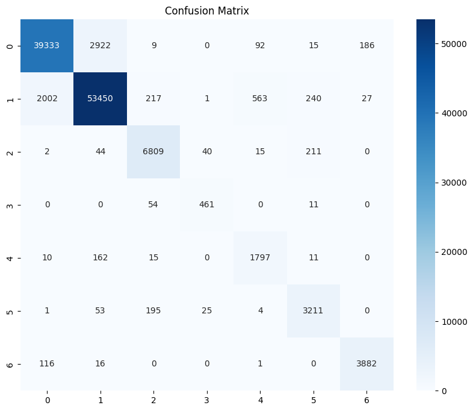

# QTM347-Final-Project: Know Your Fortest
Emory University QTM347 Final Project Repository
## Abstract
type
## Introdution
type
## Setup 
### Dataset Description
The dataset is retrieved from UC Irvine Machine Learning Repository (UCIMLR) https://doi.org/10.24432/C50K5N. The data set classifies pixel into 7 forest cover types based on 54 features(numerical & categorical), these are: 
* **Numerical:**
  * Elevation
  * Aspect
  * Slope
  * Distance to hydrology
  * Distance to roadways
  * Hillshade
  * Distance to fire points

* **Categorical:**
  * Wilderness area
  * Soil type

There is no missing values in this dataset.

**Target value distribution:** 
| Cover type | Counts |
|:----------:|:----------:|
| 2    | 283301     |
| 1    | 211840     |
| 3    | 35754      |
| 7    | 20510      |
| 6    | 17367      |
| 5    | 9493       |
| 4    | 2747       |

There is a high concentration of data entries on Cover types "2" and "1".
 
### Model Used
In this project, Logistic Regression, LDA/QDA, Random Forest, XGBoost, and Neural Network are utilized for construction of prediction model.
#### Logistic Regresion 
type
#### LDA/QDA
type
#### Random Forest 
This model is executed on Macbook Pro: Apple M3 Pro with 18GB RAM.  
In the first attempt, parameters used were:  
- (n_estimators=100, max_depth=15, min_samples_split=5, class_weight='balanced', random_state=42). The test accuracy under this set of parameters was **0.9375**.

With this optimistic accuracy obtained in the first attempt. We wanted to see if higher accuracy could be tested through cross-validation.  
Among the set of parameters:  
- (n_estimators: [50, 100, 200, 500], max_depth: [5, 10, 20, None], min_samples_split: [2, 5, 10], min_samples_leaf: [1, 2, 4], max_features: ['sqrt', 'log2', 0.5], class_weight: [None, 'balanced']). 

Best parameters are:
- (n_estimators: 500, max_depth: None, min_samples_split: 5, min_samples_leaf: 2, max_features: 0.5, class_weight: balanced). The test accuracy under this set of parameters was **0.9675**.

#### XGBoost
This model is executed on Macbook Pro: Apple M3 Pro with 18GB RAM.  
After attepmts with Random Forest, we wondered how would XGBoost perform in prediction.
In the first attempt, parameters used were:
- (n_estimators=500, learning_rate=0.01, max_depth=3, random_state=0). The test accuracy under this set of parameters was **0.7547**.

Similar to Random Forest, we tried to find the best parameters from:
- (n_estimators: [50, 100, 150, 200, 250, 300, 350, 400], max_depth: [1, 3, 5], min_samples_split: [4, 8]).

Best parameters are:
- (n_estimators: 400, max_depth: 5, min_samples_split: 8). The test accuracy under this set of parameters was **0.8213**.

#### Neural Network
type

## Results
### Independent Results
#### Random Forest
The result of Random Forest is out of expectation. It resulted high accuracy and f1 score in both attempts.
- First attmpt:
  - Classification report:
 
    | Label        | Precision | Recall | F1-score | Support |
    |--------------|-----------|--------|----------|---------|
    | 1            | 0.95      | 0.92   | 0.94     | 42557   |
    | 2            | 0.94      | 0.95   | 0.94     | 56500   |
    | 3            | 0.93      | 0.96   | 0.94     | 7121    |
    | 4            | 0.87      | 0.88   | 0.88     | 526     |
    | 5            | 0.73      | 0.90   | 0.80     | 1995    |
    | 6            | 0.87      | 0.92   | 0.89     | 3489    |
    | 7            | 0.95      | 0.97   | 0.96     | 4015    |
    | **Accuracy** |           |        | 0.94     | 116203  |
    | Macro avg    | 0.89      | 0.93   | 0.91     | 116203  |
    | Weighted avg | 0.94      | 0.94   | 0.94     | 116203  |
  - Confusion Matrix:
    

#### XGBoost

## Discussion
type
## Conclusion
type
## References
Blackard, J. (1998). Covertype [Dataset]. UCI Machine Learning Repository. https://doi.org/10.24432/C50K5N.
