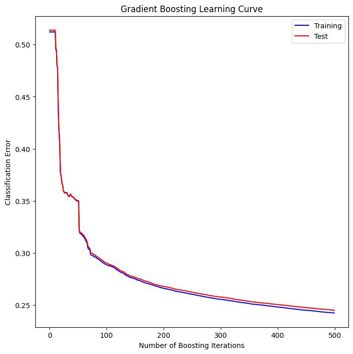

# QTM347-Final-Project: Know Your Fortest
Emory University QTM347 Final Project Repository
## Abstract
type
## Introdution
type
## Setup 
### Dataset Description
The dataset is retrieved from UC Irvine Machine Learning Repository (UCIMLR) https://doi.org/10.24432/C50K5N. The data set classifies pixel into 7 forest cover types based on 54 features(numerical & categorical), these are: 
* **Numerical:**
  * Elevation
  * Aspect
  * Slope
  * Distance to hydrology
  * Distance to roadways
  * Hillshade
  * Distance to fire points

* **Categorical:**
  * Wilderness area
  * Soil type

There is no missing values in this dataset.

**Target value distribution:** 
| Cover type | Counts |
|:----------:|:----------:|
| 2    | 283301     |
| 1    | 211840     |
| 3    | 35754      |
| 7    | 20510      |
| 6    | 17367      |
| 5    | 9493       |
| 4    | 2747       |

There is a high concentration of data entries on Cover types "2" and "1".
 
### Model Used
In this project, Logistic Regression, LDA/QDA, Random Forest, XGBoost, and Neural Network are utilized for construction of prediction model.
#### Logistic Regresion 
The parameters used were:
(multi_class='multinomial', solver='lbfgs', max_iter=1000, random_state=42)
Since we have 7 distinct classes, we use a multinomial classifier to run the logistic regression model. the 'lbfgs' solver is ideal for out dataset size, and the maximimum iteration ensures convergence. Using these parameters, we achieved a model accuracy of 0.725. 
#### LDA/QDA
For LDA and QDA, both models were trained and evaluated using a stratified 70/30 train-test split. 
Model performance was assessed using metrics such as accuracy, macro-averaged recall, and F1 score. QDA had poor outcomes, generating an accuracy of 0.0853, a macro recall of 0.4446, and a F1 score of 0.1305. In comparison, LDA performed relatively well, with an accuracy of 0.6799, a macro recall of 0.5726, and a F1 score of 0.5064. 
#### Random Forest 
This model is executed on Macbook Pro: Apple M3 Pro with 18GB RAM.  
In the first attempt, parameters used were:  
- (n_estimators=100, max_depth=15, min_samples_split=5, class_weight='balanced', random_state=42). The test accuracy under this set of parameters was **0.9375**.

With this optimistic accuracy obtained in the first attempt. We wanted to see if higher accuracy could be tested through cross-validation.  
Among the set of parameters:  
- (n_estimators: [50, 100, 200, 500], max_depth: [5, 10, 20, None], min_samples_split: [2, 5, 10], min_samples_leaf: [1, 2, 4], max_features: ['sqrt', 'log2', 0.5], class_weight: [None, 'balanced']). 

Best parameters are:
- (n_estimators: 500, max_depth: None, min_samples_split: 5, min_samples_leaf: 2, max_features: 0.5, class_weight: balanced). The test accuracy under this set of parameters was **0.9675**.

#### XGBoost
This model is executed on Macbook Pro: Apple M3 Pro with 18GB RAM.  
After attepmts with Random Forest, we wondered how would XGBoost perform in prediction, so we performed a simple modelling inXGBoost .
In the first attempt, parameters used were:
- (n_estimators=500, learning_rate=0.01, max_depth=3, random_state=0). The test accuracy under this set of parameters was **0.7547**.

Similar to Random Forest, we tried to find the best parameters from:
- (n_estimators: [50, 100, 150, 200, 250, 300, 350, 400], max_depth: [1, 3, 5], min_samples_split: [4, 8]).

Best parameters are:
- (n_estimators: 400, max_depth: 5, min_samples_split: 8). The test accuracy under this set of parameters was **0.8213**.

#### Neural Network
The parameter used were:
(Dense(64, activation='relu', input_shape=(X_train.shape[1],)), Dropout(0.3), Dense(32, activation='relu'), Dense(7, activation='softmax'))

## Results
### Independent Results
#### Logistic Regression
This baseline model showed promising results. We achieved an overall 0.725 accuracy score, which showed that the model is relatively reliable. However, we also observe that the model is less reliable when predicting certain classes. For example, the accuracy for class 5 is significantly lower than the other classes.

The model gave us an overview of what features are the most important. We see that Elevation ranked the highest with a highest coefficient.

#### LDA/QDA
The results for LDA and QDA are expected. 
QDA performed really badly, as the binary soil_type variables that could not be normally distributed really influenced the results. An accuracy score of 0.0853 makes the model's performance worse than guessing, suggesting that QDA is not suitable for this dataset without dimensionality reduction or regularization.

- Classification Report (QDA):
    | Label        | Precision | Recall | F1-score | Support |
    |--------------|-----------|--------|----------|---------|
    | 1            | 0.14      | 0.02   | 0.04     | 63552   |
    | 2            | 0.78      | 0.01   | 0.01     | 84991   |
    | 3            | 0.29      | 0.40   | 0.34     | 10726    |
    | 4            | 0.07      | 1.00   | 0.14     | 824     |
    | 5            | 0.02      | 0.71   | 0.04     | 2848    |
    | 6            | 0.04      | 0.09   | 0.05     | 5210    |
    | 7            | 0.18      | 0.89   | 0.30     | 6153    |
    | **Accuracy** |           |        | 0.09     | 174304  |
    | Macro avg    | 0.22      | 0.44   | 0.13     | 174304  |
    | Weighted avg | 0.46      | 0.09   | 0.05     | 174304  |

In comparison, LDA performs better than QDA, achieving an accuracy score of 0.6798. As LDA pools covariance estimates across all classes, it is proven to be more robust than QDA for our high-dimensional, uneven-in-class dataset. While the accuracy score could certainly be improved, it still shows better fit than QDA.

- Classification Report (LDA):
    | Label        | Precision | Recall | F1-score | Support |
    |--------------|-----------|--------|----------|---------|
    | 1            | 0.7       | 0.62   | 0.66     | 63552   |
    | 2            | 0.76      | 0.76   | 0.76     | 84991   |
    | 3            | 0.62      | 0.53   | 0.57     | 10726    |
    | 4            | 0.26      | 0.57   | 0.35     | 824     |
    | 5            | 0.29      | 0.21   | 0.24     | 2848    |
    | 6            | 0.34      | 0.51   | 0.41     | 5210    |
    | 7            | 0.41      | 0.81   | 0.55     | 6153    |
    | **Accuracy** |           |        | 0.68     | 174304  |
    | Macro avg    | 0.48      | 0.57   | 0.51     | 174304  |
    | Weighted avg | 0.69      | 0.68   | 0.68     | 174304  |

#### Random Forest
The result of Random Forest is out of expectation. It resulted high accuracy and f1 score in both attempts.
- First attempt:
  - Classification Report:
 
    | Label        | Precision | Recall | F1-score | Support |
    |--------------|-----------|--------|----------|---------|
    | 1            | 0.95      | 0.92   | 0.94     | 42557   |
    | 2            | 0.94      | 0.95   | 0.94     | 56500   |
    | 3            | 0.93      | 0.96   | 0.94     | 7121    |
    | 4            | 0.87      | 0.88   | 0.88     | 526     |
    | 5            | 0.73      | 0.90   | 0.80     | 1995    |
    | 6            | 0.87      | 0.92   | 0.89     | 3489    |
    | 7            | 0.95      | 0.97   | 0.96     | 4015    |
    | **Accuracy** |           |        | 0.94     | 116203  |
    | Macro avg    | 0.89      | 0.93   | 0.91     | 116203  |
    | Weighted avg | 0.94      | 0.94   | 0.94     | 116203  |
  - Confusion Matrix:

    
  - Top 20 Important Features:

    

- Second Attempt (Best Parameters):
  - Classification Report:

    | Label        | Precision | Recall | F1-score | Support |
    |--------------|-----------|--------|----------|---------|
    | 1            | 0.97      | 0.96   | 0.97     | 42557   |
    | 2            | 0.97      | 0.97   | 0.97     | 56500   |
    | 3            | 0.96      | 0.97   | 0.96     | 7121    |
    | 4            | 0.90      | 0.89   | 0.89     | 526     |
    | 5            | 0.89      | 0.89   | 0.89     | 1995    |
    | 6            | 0.93      | 0.94   | 0.94     | 3489    |
    | 7            | 0.96      | 0.97   | 0.97     | 4015    |
    | **Accuracy** |           |        | 0.97     | 116203  |
    | Macro avg    | 0.94      | 0.94   | 0.94     | 116203  |
    | Weighted avg | 0.94      | 0.97   | 0.97     | 116203  |
  - Confusion Matrix:

    
  - Top 5 Important Features:

    
   
#### XGBoost
- First Attmpt:
  - **Test Accuracy: 0.7547**
  - Visualized Learning Curve:

    

- Second Attempt:
  - **Test Accuracy: 0.8213**

#### Neural Network

## Discussion
Among all the models we tested, Random Forest performed the best in terms of model accuracy. At the early stage of the project, we expected Neural Network to have the highest accuracy, but we are surprised by the result that Neural Network performed similarly to XGBoost, while underperformed compared to Random Forest.

The attempt of LDA/QDA was not successful, since the classification problem this time violates the normality assumption. Random Forest was successful likely because it is a flexible, non-parametric model that makes no assumptions about the data distribution, allowing it to handle complex, non-linear relationships and interactions between features. In contrast, LDA and QDA assume normally distributed features, which can lead to poor performance if those assumptions are violated. Additionally, Random Forest is more robust to irrelevant or highly correlated features and reduces overfitting through averaging across many decision trees, whereas QDA in particular can overfit when the number of predictors is high. 

### Future Direction
Although the modelling with Neural Network did not perform well compareed to Random Forest, it is possibly due to lack of fine-tuning of hyperparameters. In our project, the hyperparameter tuning is not performed, it might be a future direction for researches to test with more combinations of hyperprameters to check if the accuracy could be improved. Otherwise, the model could also be improved by manually combining relevant features like similar soil types, since there are 40 soil types currently, the dimentional reduction might improve the robustness of model by reducing overfitting of irrelevant features. Other methods like PCA or feature selections along woth data standardization and normalization might help as well. 

### Practical Usage
The Random Forest model that we trained with best parameters could be adjusted in future for application in other forests. The model could be a measure to understand species diversity and richness in specific forest ecosystems and model impacts of environmental change. Furthermore, environmental concerns like wildfire risks could be assessed based on forest cover types and terrain conditions.

## Conclusion
type
## References
Blackard, J. (1998). Covertype [Dataset]. UCI Machine Learning Repository. https://doi.org/10.24432/C50K5N.
